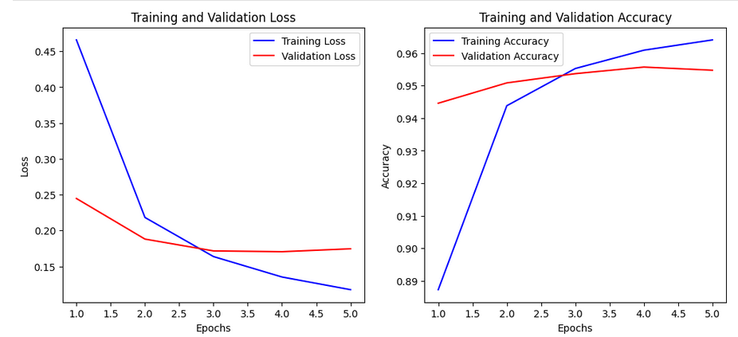

# challenge_newsela

Take-home assignment for **Newsela**

This repository contains all the code developed as part of the take-home challenge from Newsela.

Below you will find a detailed description of the code, the steps followed during development, and instructions on how to run each component.

> ⚠️ **Note:** The dataset used in this challenge is available at [Kaggle - Learning Equality Curriculum Recommendations](https://www.kaggle.com/competitions/learning-equality-curriculum-recommendations).  
> Please download the dataset manually before running any part of the code. The data is **not** included in this repository.

All code used in this challenge can be found in the `code/` folder.

> 📦 **Requirements**  
All necessary Python dependencies for this project are listed in [`code/requirements.txt`](code/requirements.txt).  
Before running the notebooks or scripts, make sure to create a virtual environment and install the required packages:

```bash
pip install -r code/requirements.txt
```
---

## 1. Exploratory Data Analysis (EDA)

After receiving the dataset, the first step was to perform an **Exploratory Data Analysis (EDA)** to understand its structure and contents. The competition provides three main files:

1. `content.csv`: Contains a list of content items identified by `content_id`, along with metadata such as `text`, `language`, and `license`.
2. `topics.csv`: A list of topics identified by `topic_id`, including metadata like `language`, `category`, and `level`.
3. `correlations.csv`: Contains mappings between `topic_id` and related `content_ids`.

### Goal

The objective is to build a "classifier" that can **match content to relevant topics**—a multilabel classification task with a large label space.

### EDA Process

The notebook `1_EDA.ipynb` was used for initial exploration. The main steps include:

1. **Loading the data and checking its dimensions.**
2. **Exploring the correlation structure** to understand how different features relate to each other.
3. **Examining the relationships between `topic_id` and `content_id`**, noting that there may be many-to-many mappings between them.
4. **Investigating a way to create embedding features** that could support training a text classification model to generate embeddings — beyond classification solely by topic.

---

## 2. Classifier

This is an **extreme multilabel classification** problem, where each content item can be linked to multiple topics. Due to the large number of unique topic labels (~76,000), instead of training a conventional multiclass model, we use a **pairwise binary classification approach**.

### Approach Overview

1. **Preprocess content text**:

   * Use the `text` field from the content dataset.
   * If `text` is missing, fall back to the `description`.
   * If both are missing, use the `title`.

2. **Truncate the text**:

   * Keep only the first 100 characters to train a BLSTM model for language classification and embedding generation.

3. **Tokenize** the text using the `bert-base-uncased` tokenizer.

4. **Train a BLSTM model** for language classification:

   * Extract the hidden layer just before the output as a learned embedding.
   * These embeddings, along with additional features, will be used to train the pairwise binary classifier.

5. **Generate embeddings**:

   * Create embeddings for all content items.
   * Process the topics dataset similarly: if `description` is missing, use `title`, then generate embeddings for each topic.

6. **Build the dataset for pairwise classification**:

   * Collect positive pairs from the provided topic-content correlations.
   * Generate `k_neg` negative samples by pairing topics and contents that are not correlated.

7. **Train a LightGBM classifier** on these positive and negative pairs to perform **pairwise binary classification**.

---

### Results

| Model                          | Metric              | Value     |
|-------------------------------|---------------------|-----------|
| **BLSTM (Language Classifier)** | Validation Accuracy | 95.47%    |
|                               | Validation Loss     | 0.1746    |
|                               | Training Curve      |  |
| **LightGBM (Pairwise Classifier)** | F1 Score           | 0.8577    |
|                               | AUC                 | 0.9745    |

---

## 3. Deployment

To serve the trained model, a deployment script was implemented using **Flask**.

### Components

- `predict_template.py`: Contains the `TopicPredictor` class.
  - Loads the trained LightGBM model.
  - Exposes a `predict` method that accepts a `content_id` and `threshold`.
  - Returns a list of predicted `topic_ids`.

- `app.py`: Defines a Flask API with a `/predict` endpoint.
  - Accepts POST requests with JSON input.
  - Returns topic predictions based on the provided content ID and confidence threshold.

### Example Usage

Once the Flask server is running, you can call the prediction endpoint with the following command:

```bash
curl -X POST http://127.0.0.1:5000/predict \
     -H "Content-Type: application/json" \
     -d '{"content_id": "c_dd739e116435", "threshold": 0.85}'
```


## 4. Future Work

Given additional time, the following areas could be explored to further improve the performance, robustness, and scalability of the solution:

### Deeper Data Exploration
- Perform **language-specific analyses** to understand how language affects topic-content relationships.
- Explore **hierarchical structures** in topics (e.g., using topic levels) to inform model design.
- Visualize embedding spaces using techniques like **UMAP** or **t-SNE** to assess the separability of topic-content pairs.

### Advanced Modeling
- Replace the BLSTM with a **transformer-based model** (e.g., DistilBERT or RoBERTa) to generate richer embeddings.
- Use **Siamese Networks** or **Dual Encoders** for direct similarity learning between content and topic embeddings.

### Hyperparameter Tuning
- Use **Optuna** to perform automated hyperparameter optimization for:
  - LightGBM parameters (e.g., `num_leaves`, `max_depth`, `learning_rate`).
  - BLSTM architecture (e.g., embedding dimensions, dropout rate, hidden units).
- Apply **cross-validation** on topic-content pairs to better estimate generalization performance.

### Model Evaluation
- Introduce additional metrics like **Precision**, **Recall**, and **Mean Average Precision (MAP)** to better evaluate multilabel predictions.
- Perform **error analysis** to identify systematic failure cases, such as confusion between similar topics.


### Data Augmentation & External Resources
- Use **data augmentation techniques** (e.g., back translation or synonym replacement) to expand the training data.
- Leverage **external knowledge bases** to enrich topic metadata for better generalization.

---

These improvements could significantly boost both the accuracy and scalability of the solution in a real-world educational content recommendation setting.
